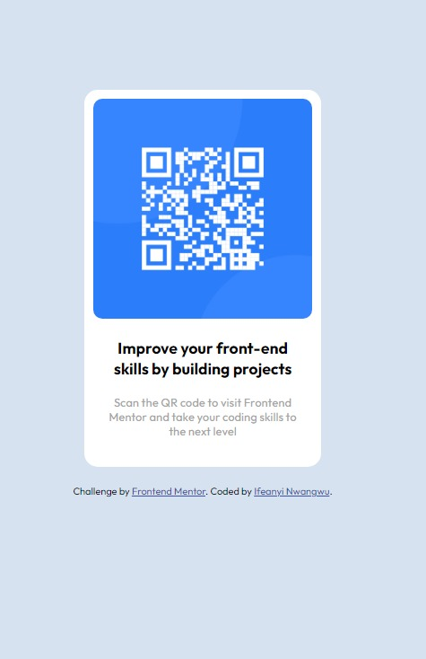

# Frontend Mentor - QR code component solution

This is a solution to the [QR code component challenge on Frontend Mentor](https://www.frontendmentor.io/challenges/qr-code-component-iux_sIO_H). Frontend Mentor challenges help you improve your coding skills by building realistic projects. 

## Table of contents

- [Overview](#overview)
  - [Screenshot](#screenshot)
  - [Links](#links)
- [My process](#my-process)
  - [Built with](#built-with)
  - [What I learned](#what-i-learned)
  - [Continued development](#continued-development)
- [Author](#author)


## Overview

### Screenshot




### Links

- Solution URL: [solution URL](https://github.com/cfez/qr-code-image)
- Live Site URL: [live site URL](https://cfez.github.io/qr-code-image/)

## My process

### Built with

- Semantic HTML5 markup
- CSS custom properties
- Mobile-first workflow


### What I learned

I was able to refresh my knowledge on HTML and CSS and also learn some new things like working with @media css rule


```@media screen and (max-width: 760px) {
    #bodycover {
      
      width: 375px;
      
    }
    #imgcover1{
        max-width: 65%;
        height: 400px;
    }
  }
```


### Continued development

I want to improve my knowledge on reponsive design.


## Author

- Frontend Mentor - [@cfez](https://www.frontendmentor.io/profile/cfez)
- Twitter - [@nwanwguifon](https://www.twitter.com/nwangwuifon)


